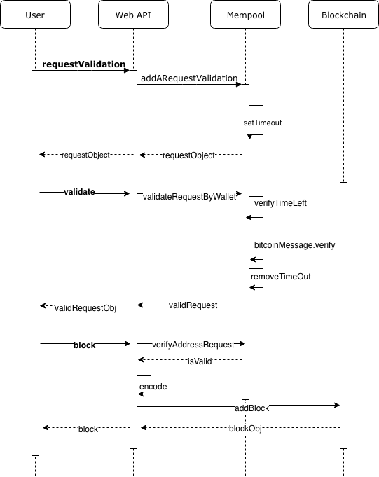

Project IV

## Secure Digital Assets on a Private BC



### Project Aim: Build a Star Registry Service that allows users to claim ownership of their favorite star in the night sky.

Blockchain dataset allows to store a Star
- The application will persist the data (using LevelDB).
- The application will allow users to identify the Star data with the owner.

Mempool component
- The mempool component will store temporal validation requests for 5 minutes (300 seconds).
- The mempool component will store temporal valid requests for 30 minutes (1800 seconds).
- The mempool component will manage the validation time window.

Create a REST API that allows users to interact with the application.
- The API will allow users to submit a validation request.
- The API will allow users to validate the request.
- The API will be able to encode and decode the star data.
- The API will allow be able to submit the Star data.
- The API will allow lookup of Stars by hash, wallet address, and height.

##### Explanation of Star Coordinates
Here is an example of how star coordinates are represented, to store it on the private blockchain:

```
RA 13h 03m 33.35sec, Dec -49° 31’ 38.1” Mag 4.83 Cen
```
These coordinates are similar to latitude and longitude but instead relate to coordinates in the sky.

Abbreviations
```
RA = Right Ascension

DEC = Declination

CEN = Centaurus

MAG = Magnitude
```


#### Add Dependencies
- crypto-js - JavaScript library of crypto standards
- express-js - Framework for RESTful API
- hex2ascii - Convert hex to ascii in JavaScript
- LevelDB - Key-/Value Store
- bitcoinjs-message - Message verify
- bitcoinjs-message node.js library requires bitcoinjs-lib to sign and verify Bitcoin message.

```
npm install crypto-js express.js hex2ascii level bitcoinjs-message bitcoinjs-lib --save
```

#### Configuring Project Repository
- Go into project order
- Use NPM to initialize your project and create package.json to store project dependencies.
```
npm init
```
#### Start local server
- Run command ```node index.js``` in the root directory

Output on console:
Blockchain API server on localhost port 8000

Start http://localhost:8000


### Endpoints (POST / GET)

The web API contains a POST endpoint that allows posting to the blockchain

Open Postman (https://www.getpostman.com)

1. POST http://localhost:8000/XXXXX
2. Body + raw + JSON (application/json)
```
{ " ... ": " ... " }
```
3. Send
4. Get Response

The collection of the following POST and GET request are linked to: 
https://www.getpostman.com/collections/dc0f2b3019e3065cd375
#

Blockchain ID validation routine

##### POST -/requestValidation http://localhost:8000/requestValidation
Request: ``` { "address":"19xaiMqayaNrn3x7AjV5cU4Mk5f5prRVpL" } ```

Respone:
```
validationWindow
{
    "walletAddress": "19xaiMqayaNrn3x7AjV5cU4Mk5f5prRVpL", 
    "requestTimeStamp": "1544451269",
    "message": "19xaiMqayaNrn3x7AjV5cU4Mk5f5prRVpL:1544451269:starRegistry",
    "validationWindow": 300
}
```

Message format = [walletAddress]:[timeStamp]:starRegistry
The request must confgure a limited validation window of five minutes.
When re-submitting within validation window, the validation window should reduce until it expires.


##### POST -/message-signature-validate http://localhost:8000/message-signature-validate
Request:
````
{ 
    "address":"19xaiMqayaNrn3x7AjV5cU4Mk5f5prRVpL",
    "signature":"H8K4+1MvyJo9tcr2YN2KejwvX1oqneyCH+fsUL1z1WBdWmswB9bijeFfOfMqK68kQ5RO6ZxhomoXQG3fkLaBl+Q="
}
````

Verify that the time window of 5 minutes didn't expired. 

Response:
```
{
    "registerStar": true, "status": {
        "address": "19xaiMqayaNrn3x7AjV5cU4Mk5f5prRVpL",
        "requestTimeStamp": "1544454641",
        "message": "19xaiMqayaNrn3x7AjV5cU4Mk5f5prRVpL:1544454641:starRegistry",
        "validationWindow": 193,
        "messageSignature": true
    } 
}
```
Upon validation, the user is granted access to register a single star.

Star registration Endpoint

##### POST -/block http://localhost:8000/block
Request:
```
{
    "address": "19xaiMqayaNrn3x7AjV5cU4Mk5f5prRVpL", 
    "star": {
        "dec": "68° 52' 56.9",
        "ra": "16h 29m 1.0s",
        "story": "Found star using https://www.google.com/sky/"
    }
}
```

The Star object and properties are stored within the body of the block of your Blockchain Dataset.
Verify that the "address" that send the Star was validated in the previous steps, if not respond back with an error.

Response:
```

{
    "hash": "8098c1d7f44f4513ba1e7e8ba9965e013520e3652e2db5a7d88e51d7b99c3cc8", 
    "height": 1,
    "body": {
        "address": "19xaiMqayaNrn3x7AjV5cU4Mk5f5prRVpL", 
        "star": {
        "ra": "16h 29m 1.0s",
        "dec": "68° 52' 56.9",
        "story": 
            "466f756e642073746172207573696e672068747470733a2f2f7777772e676f6f676c652e636f6d2f736b792f"
        } 
    },
    "time": "1544455399",
    "previousBlockHash": "639f8e4c4519759f489fc7da607054f50b212b7d8171e7717df244da2f7f2394" 
}
```

Star Lookup

##### GET -/stars/hash:[HASH] http://localhost:8000/stars/hash:[HASH]
```
{
    "hash": "a59e9e399bc17c2db32a7a87379a8012f2c8e08dd661d7c0a6a4845d4f3ffb9f", 
    "height": 1,
    "body": {
        "address": "142BDCeSGbXjWKaAnYXbMpZ6sbrSAo3DpZ", 
        "star": {
            "ra": "16h 29m 1.0s",
            "dec": "-26° 29' 24.9",
            "story": "466f756e642073746172207573696e672068747470733a2f2f7777772e676f6f676c652e636f6d2f736b792f",
            "storyDecoded": "Found star using https://www.google.com/sky/"
        }
    },
    "time": "1532296234",
    "previousBlockHash": "49cce61ec3e6ae664514d5fa5722d86069cf981318fc303750ce66032d0acff3" 
}
```
##### GET -/stars/hash:[ADDRESS] http://localhost:8000/stars/hash:[ADDRESS]
```
[ {
    "hash": "6ef99fc533b9725bf194c18bdf79065d64a971fa41b25f098ff4dff29ee531d0", "height": 1,
    "body": {
    "address": "142BDCeSGbXjWKaAnYXbMpZ6sbrSAo3DpZ", "star": {
    "ra": "17h 22m 13.1s",
    "dec": "-27° 14' 8.2",
    "story": "466f756e642073746172207573696e672068747470733a2f2f7777772e676f6f676c652e6
    36f6d2f736b792f",
    "storyDecoded": "Found star using https://www.google.com/sky/"
    } },
    "time": "1532330848",
    "previousBlockHash": "a59e9e399bc17c2db32a7a87379a8012f2c8e08dd661d7c0a6a4845d4f3ffb9f" }
]
```

##### GET -/stars/block:[HEIGHT] http://localhost:8000/stars/block:[HEIGHT]
```
{
"hash": "a59e9e399bc17c2db32a7a87379a8012f2c8e08dd661d7c0a6a4845d4f3ffb9f", "height": 1,
"body": {
    "address": "142BDCeSGbXjWKaAnYXbMpZ6sbrSAo3DpZ", 
    "star": {
        "ra": "16h 29m 1.0s",
        "dec": "-26° 29' 24.9",
        "story": "466f756e642073746172207573696e672068747470733a2f2f7777772e676f6f676c652e636
        f6d2f736b792f",
        "storyDecoded": "Found star using https://www.google.com/sky/"
    } 
},
"time": "1532296234",
"previousBlockHash": "49cce61ec3e6ae664514d5fa5722d86069cf981318fc303750ce66032d0acff3" 
}
```


#### POST Block Endpoint

The web API contains a POST endpoint that allows posting to the blockchain


Open Postman (https://www.getpostman.com)

1. POST http://localhost:8000/XXXXX
2. Body + raw + JSON (application/json)
```
{ " ... ": " ... " }
```
3. Send
4. Get Response


