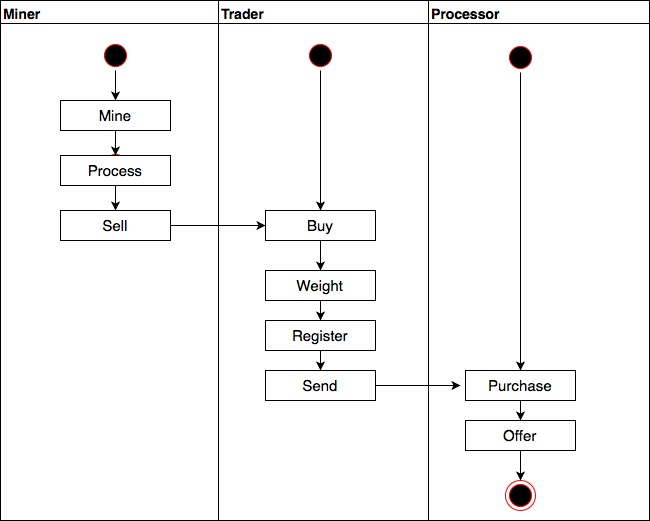
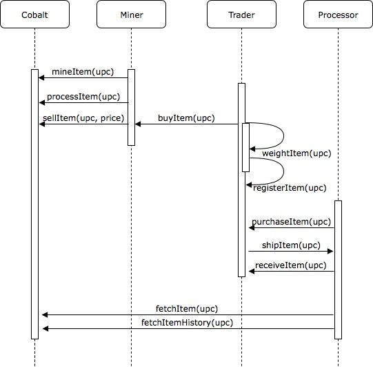

Project V

## Blockchain Architecture: Cobald Supply Chain 

Source: https://www.itransition.com/blog/business-with-no-intermediaries-using-blockchain-best-use-cases

####Cobalt Supply Chain Journey:

The supply chain journey is modeled with https://www.draw.io/

The UML-Diagrams are required to code it in Project 7. 

#### Activity Diagram

#### Sequence Diagram

#### State Diagram

#### Class Diagram

